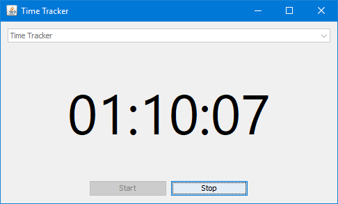

# Time Tracker

This is a very simple program for tracking the amount of time you spend on each of your projects.

You are able to enter the name of the project, or select an existing one and then start the timer. When you stop the timer and the close the program, your times will be saved to a file in the same directory as the program, so you can put it on a USB stick if need be.